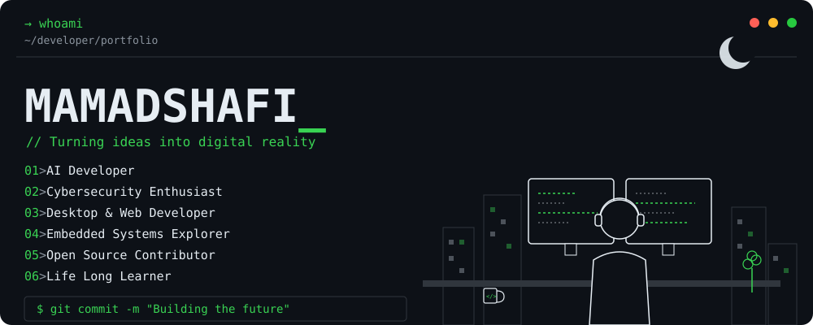

<div align="center">



</div>

<div align="center">

[](https://github.com/MAMADSHAFI)
[](https://linkedin.com/in/mamadshafi)
[](https://x.com/MAMADSHAFI_)
[](mailto:mamadshafi.dev@gmail.com)

</div>

---

### `> about_me.py`

```python
class AboutMe:
    def __init__(self):
        self.name = "MAMADSHAFI"
        self.role = "Developer"
        self.focus = ["AI", "Cybersecurity",
                      "Open Source", "Tech"]
        self.goal = "Build things that matter"

    def say_hi(self):
        print("Thanks for visiting my profile!")
        print("Let's build something amazing together.")


me = AboutMe()
me.say_hi()
```

### `> GitHub Stats`

<div align="center">


</div>

### `> Tech_Stack.exe`

<div align="center">


</div>

### `> Featured_Projects.json`

<div align="center">

[](https://github.com/MAMADSHAFI/AI-Assistant)
[](https://github.com/MAMADSHAFI/CyberTools)
[](https://github.com/MAMADSHAFI/DeskFlow)
[](https://github.com/MAMADSHAFI/EmbedOS)

</div>

### `> Quote.txt`

```
"Code is like humor.
 When you have to explain it,
 it's bad."
                    - Cory House
```

<div align="center">

❤️ Thanks for stopping by! &nbsp;•&nbsp; Let's connect and build the future together. &nbsp;•&nbsp; ⚡ Keep Coding. Stay Curious.


</div>

